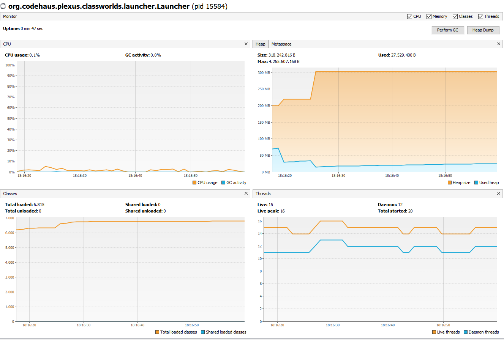
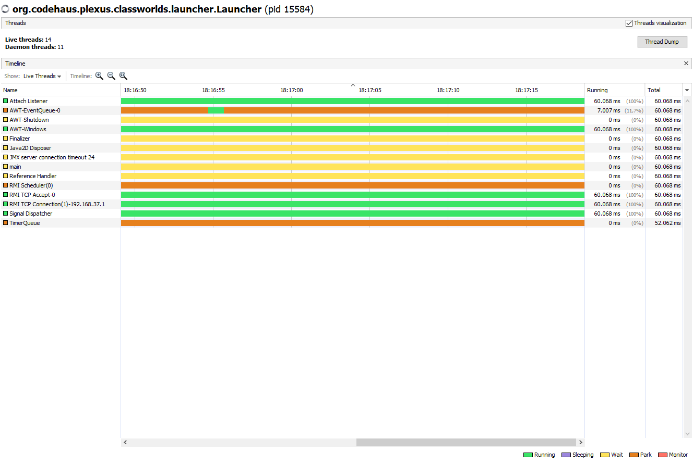
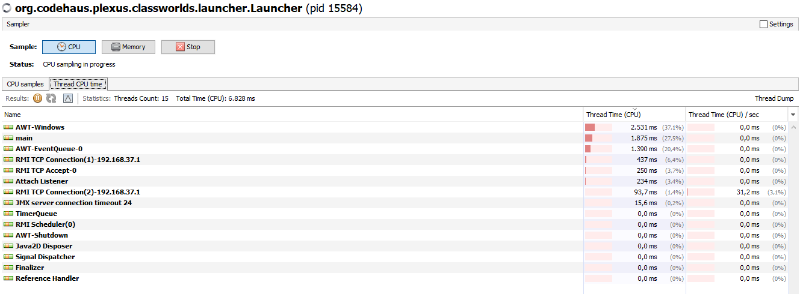
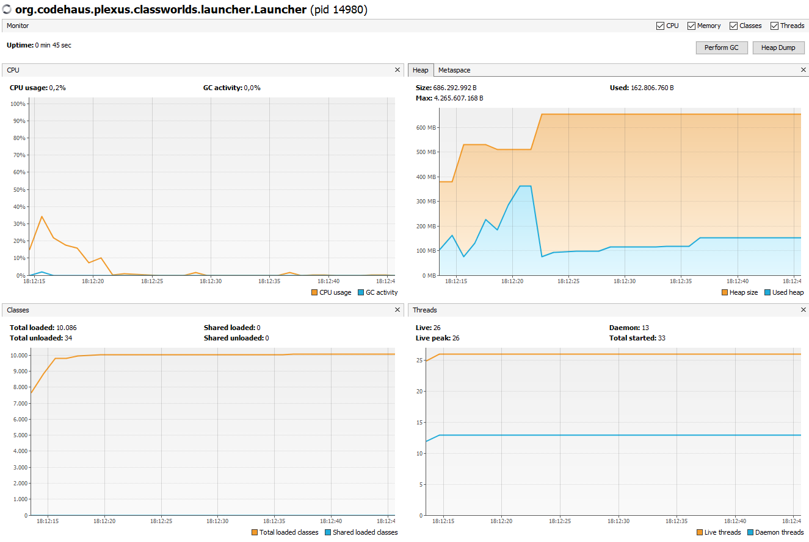
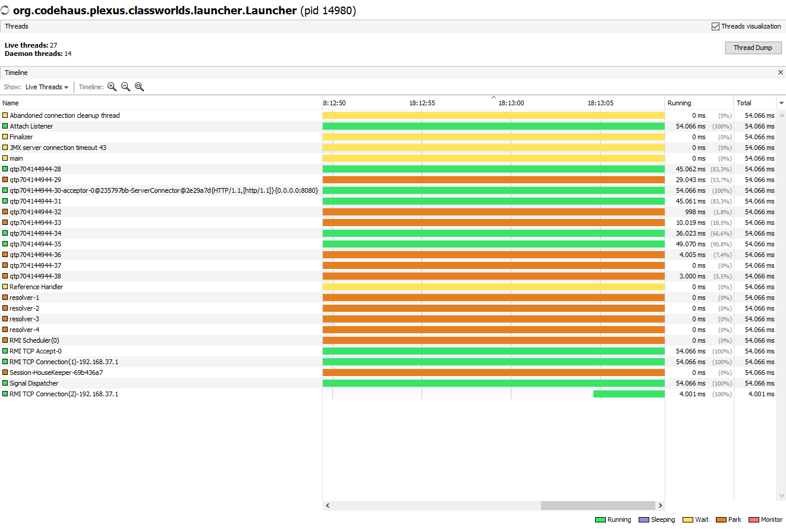
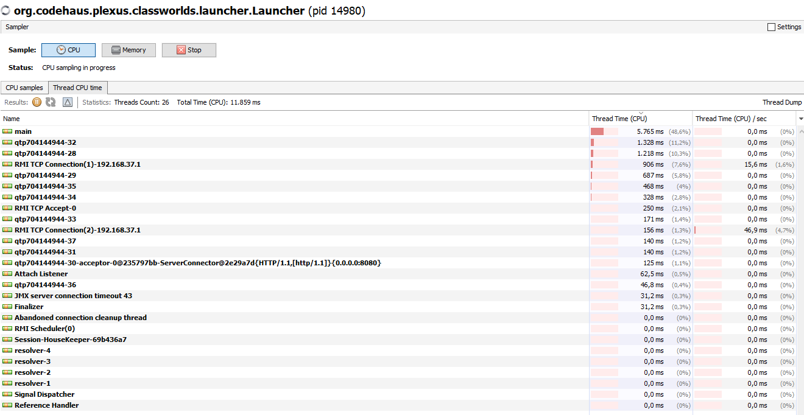

# Festival de Cine: Profiling

## Contexto

En este pequeño subdirectorio se ha añadido una explicación gráfica del uso para profiling con VisualVM
para esta aplicación.

### A) Lado Cliente

En la primera imagen se puede observar la necesidad de CPU, montón, clases e hilos del lado Cliente.
Como se puede observar, esta no es precisamente una aplicación que lo sobrecargue.

En la segunda imagen se puede observar un análisis más profundo de los hilos que se encuentran en
distintos estados en ese momento. Esencialmente los que están activos son los que mantienen la
conexión con el Lado Servidor y los que gestionan las ventanas en Java (AWT).

En la tercera imagen se puede observar el consumo de CPU por hilo, donde los hilos de AWT y Main son
los que más consumen, como es de esperar.

### B) Lado Servidor

En la primera imagen se puede observar la necesidad de CPU, montón, clases e hilos del lado Servidor.
En este caso, sí se puede observar una sobrecarga inicial, cuando se envían los Fixtures desde el
FestivalCineController para que se almacenen una serie de datos iniciales (en caso
de que no existan) y que sean los que se puedan utilizar en la ejecución de la aplicación.

En la segunda imagen se puede observar un análisis más profundo de los hilos que se encuentran en
distintos estados en ese momento. En comparación con el Lado Cliente, se puede observar que hay 
bastantes más hilos "muertos", seguramente relacionados con las transacciones hechas vía el API
RESTful.

En la tercera imagen se puede observar el consumo de CPU por hilo, donde el hilo Main es el
protagonista, aunque haya muchos pequeños hilos de transacción que han desaparecido casi al momento.

